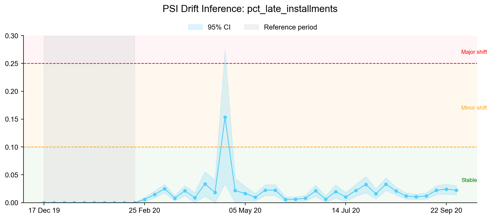
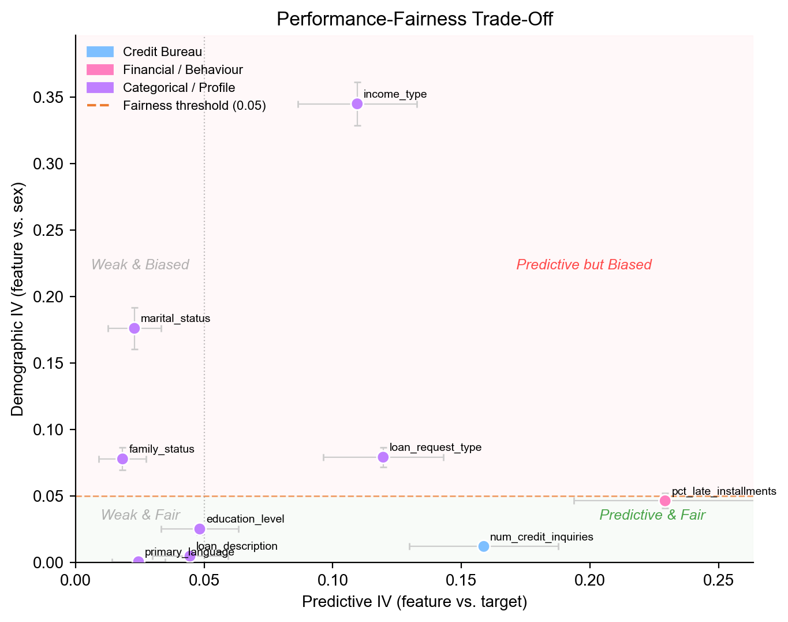

Every credit data scientist learns to compute Weight of Evidence (WoE), Information Value (IV), and the Population Stability Index (PSI) early in their career. Few are taught where the formulas come from. The answer leads back to Turing's wartime *weight of evidence* for codebreaking [@good1950probability], Shannon's information theory [@shannon1948mathematical], and a family of divergence measures that statisticians have studied for decades [@kullback1951information; @jeffreys1961theory].

In a recent paper [@sudjianto2025information], we prove a simple but consequential identity: the industry-standard IV formula is mathematically identical to the Jeffreys divergence between good and bad borrower distributions. PSI is the same divergence computed over time. And a "fairness IV" is the same divergence computed across demographic groups. Once that connection is made explicit, standard statistical tools become available --- and three things change in day-to-day practice:

1. You can **report a confidence interval on IV** when ranking features, not just a point estimate.
2. You can **formally test whether a PSI shift is real drift** or sampling noise.
3. You can **defend fairness constraints** under model risk review with probabilistic bounds.

This article walks through the identity, derives the standard errors, and shows how each of these works on the publicly available Home Credit dataset [@homecredit2024].

## The identity: IV = PSI = Jeffreys divergence

Start with the textbook IV formula. For a feature binned into $J$ categories, let $p_{g,j}$ and $p_{b,j}$ be the proportions of good and bad borrowers in bin $j$. Information Value is defined as [@siddiqi2017intelligent]:

$$
\text{IV} = \sum_{j=1}^{J}(p_{b,j} - p_{g,j})\,\ln\frac{p_{b,j}}{p_{g,j}}
$$ {#eq-iv}

Now consider the Jeffreys divergence, defined as the symmetrised Kullback--Leibler divergence [@kullback1951information; @jeffreys1961theory]:

$$
J(P \| Q) = D_{\text{KL}}(P \| Q) + D_{\text{KL}}(Q \| P) = \sum_j (p_j - q_j)\,\ln\frac{p_j}{q_j}
$$ {#eq-jeffreys}

Set $P = P_b$ and $Q = P_g$, and @eq-iv is exactly @eq-jeffreys. That is all the proof requires --- the industry IV formula *is* the Jeffreys divergence, written in a different notation.

The same formula appears elsewhere in credit risk under the name Population Stability Index, where $P$ is a reference distribution and $Q$ is a comparison distribution measured at a later point in time. And if $P$ and $Q$ are the feature distributions of two demographic groups, the same formula quantifies demographic bias.

::: {.column-margin}
**One formula, three applications.** IV, PSI, and fairness IV are all the Jeffreys divergence $J(P \| Q)$ applied to different partitions of the data.
:::

This is not merely a notational coincidence. It means that every property of the Jeffreys divergence --- non-negativity, symmetry, zero if and only if $P = Q$ --- automatically applies to IV and PSI, grounding decades of ad hoc thresholds (0.02, 0.10, 0.30) in a well-understood statistical quantity [@cover2005elements].

## Standard errors from the delta method

The practical payoff of the identity is that it opens the door to statistical inference. Because IV is a function of sample proportions, it has a sampling distribution, and we can derive its standard error.

### WoE and location invariance

The key observation is that Weight of Evidence is a *centred* log-odds ratio:

$$
\text{WoE}_j = \underbrace{\ln\frac{n_{j,b}}{n_{j,g}}}_{\text{bin log-odds}} - \underbrace{\ln\frac{n_b}{n_g}}_{\text{population log-odds}}
$$ {#eq-woe}

Subtracting a constant does not change the variance --- a property familiar from Welford's algorithm for numerically stable variance computation. Since $\text{Var}(X - K) = \text{Var}(X)$ for any constant $K$, the standard error of WoE is identical to the standard error of the bin-level log-odds ratio:

$$
\text{SE}(\text{WoE}_j) = \sqrt{\frac{1}{n_{j,g}} + \frac{1}{n_{j,b}}}
$$ {#eq-se-woe}

This can also be written as $1/\sqrt{n_j \cdot p_j(1-p_j)}$, where $n_j$ is the bin size and $p_j$ is the bin event rate --- the same expression that appears as the standard error of a logistic regression coefficient. Hand and Henley [-@hand1997statistical] describe both WoE encoding and logistic regression as standard tools in credit scoring; the connection between their standard errors is made explicit in our paper [@sudjianto2025information].

### From WoE standard errors to IV standard errors

Since IV is a weighted sum of WoE values, the delta method propagates the uncertainty. Assuming approximate independence across bins:

$$
\text{SE}(\text{IV}) = \sqrt{\sum_{j=1}^{J}(p_{b,j} - p_{g,j})^2 \cdot \text{SE}(\text{WoE}_j)^2}
$$ {#eq-se-iv}

Because we established that IV = PSI = Jeffreys divergence, the same formula applies to PSI whenever it is computed from binned counts.

## What changes in practice

### 1. Confidence intervals on IV

With @eq-se-iv, every IV point estimate gains an uncertainty bound:

$$
\text{CI}_{95\%}(\text{IV}) = \text{IV} \pm 1.96 \cdot \text{SE}(\text{IV})
$$

@fig-iv-ci shows this applied to 10 features from the Home Credit dataset. The error bars reveal that some features with similar point estimates have very different precision --- a distinction invisible without standard errors.

::: {#fig-iv-ci}
{fig-alt="Horizontal bar chart showing Information Value for 10 features with human-readable names, with 95% confidence interval error bars. Features are colored by group: blue for Credit Bureau, pink for Financial/Behaviour, and purple for Categorical/Profile. Vertical dashed lines mark the conventional Weak (0.02), Medium (0.1), and Strong (0.3) IV thresholds."}

Information Value with 95% confidence intervals for 10 features from the Home Credit dataset, computed using the delta-method standard error from @eq-se-iv. Colours indicate feature group: Credit Bureau (blue), Financial/Behaviour (pink), Categorical/Profile (purple).
:::

The standard error also enables a formal hypothesis test for feature relevance. Under $H_0\!: \text{IV} = 0$ (no predictive power), the test statistic $Z = \text{IV} / \text{SE}(\text{IV})$ is asymptotically standard normal. In the Home Credit data, all 10 features reject the null at the 5\% level --- but this will not always be the case, particularly for smaller portfolios or finer binning schemes where sampling noise dominates.

### 2. Testing whether PSI drift is real

The same SE formula applies to PSI. @fig-psi shows PSI computed weekly for the top-IV feature against a four-week reference period. With confidence intervals, weeks where PSI barely crosses the conventional 0.10 threshold can be assessed probabilistically --- "Is this drift statistically significant, or could it be sampling noise?" --- rather than triggering automatic remediation.

::: {#fig-psi}
{fig-alt="Line chart showing PSI values over approximately 38 weeks for the top feature. Points are colored pink if the drift is statistically significant (Z > 1.96) and cyan if not. A shaded band shows the 95% confidence interval. Horizontal dashed lines mark minor shift (0.1) and major shift (0.25) thresholds."}

PSI over time for the highest-IV feature, with 95% confidence bands from the delta method. Points are coloured by statistical significance: pink if $Z > 1.96$ (drift is real), cyan if the shift is indistinguishable from sampling noise.
:::

### 3. Defending fairness constraints

Because the same divergence formula measures both predictive power and demographic bias, the performance--fairness trade-off can be stated precisely:

- **Maximise** $\text{IV}_{\text{perf}}$ --- Jeffreys divergence between good and bad borrowers (predictive power)
- **Minimise** $\text{IV}_{\text{fair}}$ --- Jeffreys divergence between demographic groups (fairness)

With standard errors, a hard regulatory threshold such as $\text{IV}_{\text{fair}} \leq 0.05$ becomes a probabilistic constraint:

$$
P(\text{IV}_{\text{fair}} \leq \epsilon) \geq 95\%
$$ {#eq-fairness}

This transforms binary pass/fail compliance into a risk-based assessment. A feature with $\text{IV}_{\text{fair}} = 0.048 \pm 0.001$ is qualitatively different from one with $\text{IV}_{\text{fair}} = 0.048 \pm 0.020$, even though both have the same point estimate.

@fig-pareto shows predictive IV plotted against demographic IV (computed against applicant sex) for each feature. The horizontal threshold line at 0.05 separates features that pass the fairness constraint from those that fail --- but the error bars show that for some features near the boundary, the classification depends on the confidence level chosen.

The most prominent outlier is `income_type`, with a demographic IV of 0.35. Inspecting the category proportions reveals why: retired pensioners make up 18.5% of female applicants but only 5.7% of males, and salaried government employees account for 19.5% of women versus 7.0% of men. The feature is not encoding a prejudice --- it is reflecting a real demographic difference in employment composition. But a scorecard that includes it will implicitly treat women and men differently, which is precisely what the high IV flags. Whether that is acceptable is a regulatory decision; the statistics quantify the size of the gap.

::: {#fig-pareto}
{fig-alt="Scatter plot with Predictive IV on the x-axis and Demographic IV on the y-axis. Each point is a feature, colored by group. Error bars show 95% confidence intervals on both axes. A horizontal dashed orange line marks the fairness threshold at IV = 0.05."}

Performance--fairness trade-off for 10 features. Horizontal axis: IV against the default target (predictive power). Vertical axis: IV against applicant sex (demographic bias). Features above the dashed line ($\text{IV}_{\text{fair}} > 0.05$) fail the fairness constraint at the 95% confidence level.
:::

A more nuanced test goes further: compute IV *separately* for each demographic group on shared bins, then test whether the difference is significant. @fig-density shows this for the top feature, percent of late installments. The left panel plots the IV sampling distribution for female and male applicants; the right panel shows the distribution of the difference. The feature is more predictive for women (IV = 0.31) than for men (IV = 0.21), and the gap is statistically significant ($\Delta\text{IV} = -0.091$, $p = 0.002$). This kind of differential predictive power --- invisible without standard errors --- has direct implications for equal treatment.

::: {#fig-density}
{fig-alt="Two-panel figure. Left panel shows two normal density curves for the IV of percent late installments, one for female applicants (pink, IV around 0.31) and one for male applicants (cyan, IV around 0.21), with vertical dashed lines at the Weak, Medium, and Strong IV thresholds. Right panel shows the normal density of the IV difference (Male minus Female), centred at minus 0.09, with 95% confidence interval dotted lines and a vertical black line at zero."}

IV density by sex for percent of late installments. Left: IV sampling distributions for female and male groups (delta-method normal approximation). Right: distribution of the difference $\Delta\text{IV}$; zero falls outside the 95% CI, confirming the gap is statistically significant.
:::

The full optimisation of this trade-off --- tracing the Pareto frontier via mixed-integer programming, selecting features that jointly maximise performance subject to fairness budgets --- is developed in the paper [@sudjianto2025information]. The key contribution here is the *statistical* one: standard errors make the trade-off quantitative rather than binary.

## Code and data

All results in this article are reproduced in a companion Jupyter notebook, available at [github.com/deburky/rwds-submission](https://github.com/deburky/rwds-submission). The notebook uses the [Home Credit --- Credit Risk Model Stability](https://huggingface.co/datasets/deburky/home-credit-credit-risk-model-stability) dataset (522,596 loan applications, 10 features) and can be run directly from HuggingFace without downloading the raw Kaggle data. WoE encoding, IV computation, and standard errors are computed using the open-source [FastWoe](https://github.com/xRiskLab/fastwoe) library.

## Conclusion

Weight of Evidence, Information Value, and the Population Stability Index are not ad hoc metrics. They are specific instances of the Jeffreys divergence --- a quantity with well-understood statistical properties dating back to the 1940s. Recognising this identity is not merely an intellectual exercise: it gives the delta method a purchase, and the delta method gives standard errors, confidence intervals, and hypothesis tests.

The practical upshot for credit data scientists is concise. When you rank features by IV, report the confidence interval --- a feature with IV = 0.15 $\pm$ 0.04 may not be meaningfully different from one with IV = 0.12 $\pm$ 0.03. When PSI crosses a threshold, test whether the shift is statistically significant before triggering remediation. And when defending a model under fairness review, present the probability that your fairness IV falls within the regulatory budget, not just the point estimate.

These are small changes in workflow, but they move credit risk practice from point estimates to inference --- which is, after all, what statistics is for.

::: {.article-btn}
[Back to Foundations & Frontiers](https://realworlddatascience.net/ideas/foundations-and-frontiers/)
:::

::: {.further-info}
::: grid
::: {.g-col-12 .g-col-md-12}
About the authors
: **Agus Sudjianto** is Chief AI Scientist at H2O.ai and Professor of Practice at the Center for Trustworthy AI Through Model Risk Management, University of North Carolina Charlotte. He was formerly Head of Corporate Model Risk at Wells Fargo.

: **Denis Burakov** is a Data Science Team Lead and Fellow of the Royal Statistical Society. He focuses on applied credit risk modelling, information-theoretic methods, and open-source tooling for responsible AI.
:::
::: {.g-col-12 .g-col-md-6}
Copyright and licence
: &copy; 2026 Agus Sudjianto and Denis Burakov

 This article is licensed under a Creative Commons Attribution 4.0 (CC BY 4.0) <a href="http://creativecommons.org/licenses/by/4.0/?ref=chooser-v1" target="_blank" rel="license noopener noreferrer" style="display:inline-block;"> International licence</a>.

:::

::: {.g-col-12 .g-col-md-6}
How to cite
: Sudjianto, Agus, and Denis Burakov. 2026. "The Hidden Statistics Behind Credit Risk." Real World Data Science, June, 2026. [URL](https://realworlddatascience.net)
:::
:::
:::

::: {.callout-note appearance="simple"}
**AI disclosure.** Claude (Anthropic) was used to assist with code development for the companion notebook and to help structure drafts of this article. All mathematical content, analysis, and editorial decisions are the authors' own.
:::
